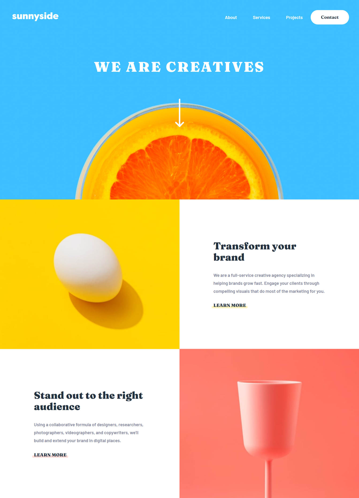
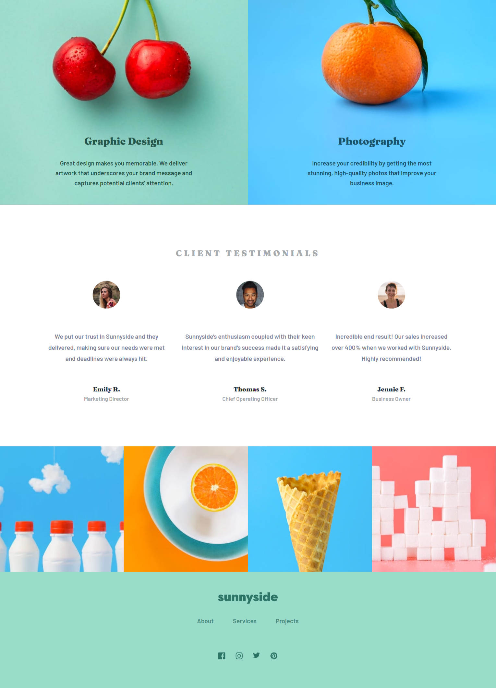

# Frontend Mentor - Sunnyside agency landing page solution

This is a solution to the [Sunnyside agency landing page challenge on Frontend Mentor](https://www.frontendmentor.io/challenges/sunnyside-agency-landing-page-7yVs3B6ef). Frontend Mentor challenges help you improve your coding skills by building realistic projects.

## Table of contents

- [Overview](#overview)
  - [The challenge](#the-challenge)
  - [Screenshot](#screenshot)
  - [Links](#links)
- [My process](#my-process)
  - [Built with](#built-with)
  - [What I learned](#what-i-learned)
  - [Useful resources](#useful-resources)
- [Author](#author)

## Overview

### The challenge

Users should be able to:

- View the optimal layout for the site depending on their device's screen size (375px and 1440px)
- See hover states for all interactive elements on the page

### Screenshot




### Links

- Solution URL: [Github](https://github.com/MatheusHG94/landing-page-fem)
- Live Site URL: [Vercel](https://landing-page-fem-ten.vercel.app/)

## My process

### Built with

- Semantic HTML5 markup
- SCSS custom properties
- Flexbox
- Mobile-first workflow
- [React](https://reactjs.org/) - JS library

### What I learned

```js
const [windowWidth, setWindowWidth] = useState(window.innerWidth);

useEffect(() => {
  const handleWindowResize = () => {
    setWindowWidth(window.innerWidth);
  };

  window.addEventListener('resize', handleWindowResize);

  return () => {
    window.removeEventListener('resize', handleWindowResize);
  };
});
```

### Useful resources

- [getting window width on resize](https://codingbeautydev.com/blog/react-get-window-width-on-resize/) - This helped me setting the images that change according to devices size.

## Author

- GitHub - [@MatheusHG94](https://github.com/MatheusHG94)
- Frontend Mentor - [@MatheusHG94](https://www.frontendmentor.io/profile/MatheusHG94)
- Linkedin - [@matheushg-7654](https://www.linkedin.com/in/matheushg-7654/)
